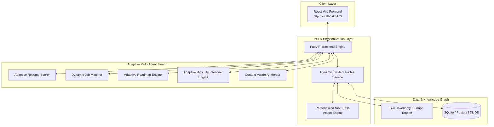

# 🧠 PlaceAI Platform — Technical Evaluation & Dynamic Evolution Blueprint

> **Document Version**: 2.0.0  
> **Status**: Comprehensive Analysis & Implementation Roadmap  
> **Focus**: Transforming PlaceAI from Static Modules into an **Adaptive Closed-Loop Personalization Engine**

---

## 📋 Table of Contents
1. [Deep Technical Evaluation & Efficiency Rating](#1-deep-technical-evaluation--efficiency-rating)
2. [Critical Drawbacks & Technical Vulnerabilities](#2-critical-drawbacks--technical-vulnerabilities)
3. [The Core Philosophy: Static vs. Dynamic PlaceAI](#3-the-core-philosophy-static-vs-dynamic-placeai)
4. [Architecture Blueprint: Dynamic Personalization Engine](#4-architecture-blueprint-dynamic-personalization-engine)
5. [Module-by-Module Dynamic Feature Enhancements](#5-module-by-module-dynamic-feature-enhancements)
6. [Implementation Action Plan](#6-implementation-action-plan)

---

## 1. Deep Technical Evaluation & Efficiency Rating

### Overall Scorecard

| Assessment Dimension | Rating | Technical Reality in PlaceAI |
|---|---|---|
| **End-to-End Pipeline Coverage** | **9.5 / 10** | Unifies Resume → Job → Skill Gap → Roadmap → Interview → Dashboard seamlessly. |
| **Multi-Agent Architecture** | **9.0 / 10** | Decoupled specialized agents (`ResumeAgent`, `JobAgent`, `InterviewAgent`, `MentorAgent`, `CriticAgent`). |
| **API Cleanness & REST Design** | **9.0 / 10** | Clear FastAPI routing with `Pydantic` models and 28 passing `Pytest` tests. |
| **Personalization Depth** | **5.5 / 10** | *Currently Session-bound, but outputs remain mostly static per job text rather than user-adaptive.* |
| **AI Reliability & Validation** | **6.0 / 10** | Relies on single-prompt LLM scoring without deterministic fallback ontologies or explainable weights. |
| **Scalability & Security** | **6.5 / 10** | SQLite is suitable for demo, but synchronous LLM blocking calls & raw `X-Session-ID` present bottlenecks. |

---

## 2. Critical Drawbacks & Technical Vulnerabilities

### ⚠️ Drawback 1: Cascading AI Errors (LLM Over-Dependency)
- **Problem**: If the `ResumeAgent` misidentifies a skill (e.g. misses `FastAPI` because it was written as `Fast-API framework`), downstream modules suffer:
  $$\text{Wrong Skill Extraction} \longrightarrow \text{Flawed Job Match} \longrightarrow \text{Invalid Skill Gap} \longrightarrow \text{Irrelevant Roadmap}$$
- **Fix**: Implement a **Deterministic Skill Taxonomy & Normalization Engine** before handing data to the LLM.

### ⚠️ Drawback 2: Unexplainable ATS & Match Scoring
- **Problem**: Match scores (e.g., `83%`) are generated directly by Gemini. If an evaluator asks *"Why 83% and not 78%?"*, there is no formula.
- **Fix**: Use an **Explainable Formula Engine**:
  $$\text{Match \%} = (0.40 \times \text{Skill Match}) + (0.25 \times \text{Keyword Match}) + (0.20 \times \text{Experience}) + (0.15 \times \text{Projects})$$

### ⚠️ Drawback 3: Static "One-Size-Fits-All" Roadmaps & Interviews
- **Problem**: All users with missing `Docker` skills receive the exact same 3-phase roadmap, regardless of whether they have 3 days or 30 days before their interview.
- **Fix**: Inject **Candidate Constraints** (Time Available, Seniority Level, Interview Date, Past Interview Weaknesses).

### ⚠️ Drawback 4: Lack of a Closed-Loop Feedback Engine
- **Problem**: After a student completes a roadmap module or finishes a mock interview, the system doesn't re-assess or adjust future interview questions based on demonstrated weaknesses.
- **Fix**: Implement the **Closed-Loop Improvement Engine** (`Assess → Identify Weakness → Learn → Test → Re-evaluate`).

---

## 3. The Core Philosophy: Static vs. Dynamic PlaceAI

```text
❌ STATIC APPROACH (Current):
User Input ──► Resume Parsing ──► Standard Match ──► Standard Roadmap ──► Generic Questions

✅ ADAPTIVE DYNAMIC APPROACH (Evolution Target):
                  ┌──────────────────────────────┐
                  │ DYNAMIC STUDENT PROFILE BRAIN │
                  │  • Target Role & Deadline     │
                  │  • Time Commitment (hrs/day) │
                  │  • Historical Weaknesses      │
                  │  • Skill Taxonomy Graph      │
                  └──────────────┬───────────────┘
                                 │
     ┌───────────────────────────┼───────────────────────────┐
     ▼                           ▼                           ▼
Dynamic Resume              Dynamic Adaptive            Dynamic Actionable
Strategy & ATS              Difficulty Interview            Dashboard
```

---

## 4. Architecture Blueprint: Dynamic Personalization Engine



---

## 5. Module-by-Module Dynamic Feature Enhancements

### 1️⃣ Dynamic Student Profile Engine (`backend/app/models.py` & `backend/app/services/profile.py`)
- **Key Enhancements**:
  - `target_role` (e.g. `Backend Engineer`, `Data Scientist`, `DevOps`)
  - `available_hours_per_day` (e.g. `2 hours/day`)
  - `target_interview_date` (e.g. `14 days left`)
  - `historical_weaknesses` (e.g. `["PostgreSQL Optimization", "STAR Method"]`)
  - `skill_mastery_matrix` (e.g. `{"Python": 90, "Docker": 40, "FastAPI": 85}`)

### 2️⃣ Dynamic Adaptive Difficulty Interview Coach (`backend/app/agents/interview_agent.py`)
- **Adaptive Difficulty Logic**:
  - If previous answer score $> 85\%$: Automatically increase difficulty (`Medium` $\rightarrow$ `Advanced / System Design`).
  - If previous answer score $< 60\%$: Drop difficulty, insert concept explanation, and re-test with a targeted simpler question.
  - Evaluate responses explicitly across **STAR Metrics** (Situation: X/10, Task: X/10, Action: X/10, Result: X/10).

### 3️⃣ Dynamic Actionable Dashboard (`backend/app/routers/dashboard.py`)
- **"Today's Highest Priority Action" Banner**:
  - *Example 1*: `"Your target job requires Docker, but your mock interview score in containerization was 45%. Complete Phase 1 of your Docker Roadmap today."`
  - *Example 2*: `"Your skills match 92% of the Job Description, but your resume lacks quantifiable metrics. Modify 3 project bullet points before applying."`

### 4️⃣ Deterministic Skill Taxonomy & Graph Engine (`backend/app/services/taxonomy.py`)
- **Normalization Map**:
  - `FastAPI`, `Fast-API`, `FastAPI framework` $\rightarrow$ `FastAPI` (Child of `Python Backend`).
  - `K8s`, `Kubernetes`, `Kube` $\rightarrow$ `Kubernetes` (Child of `Container Orchestration`).

---

## 6. Implementation Action Plan

### Phase 1: Dynamic Student Profile & Skill Taxonomy (Immediate)
- Update `backend/app/schemas.py` and `backend/app/models.py` to add `StudentProfile` fields.
- Build `backend/app/services/taxonomy.py` for standardizing skill aliases.

### Phase 2: Adaptive Difficulty Interview Engine
- Upgrade `InterviewAgent` to consume past `InterviewHistory` records and dynamically adjust question complexity.

### Phase 3: Personalized Next-Best-Action Dashboard
- Update `/api/dashboard/summary` to compute personalized recommendations based on the candidate's lowest scoring metric.

---

*This blueprint provides the complete architectural roadmap to make PlaceAI a 100% dynamic, personalized placement intelligence platform.*
