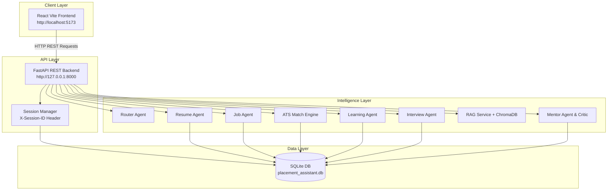
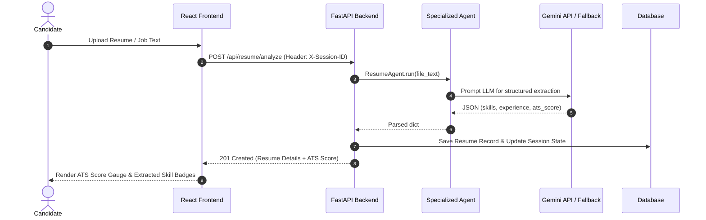

# 🚀 PlaceAI Platform — System Architecture & Workflow Analysis

> **Document Version**: 1.0.0  
> **Date**: September 6, 2026  
> **Platform**: AI-Powered Placement Assistant & Career Readiness Platform

---

## 📋 Table of Contents
1. [Executive Overview & Requirements](#1-executive-overview--requirements)
2. [Technology Stack](#2-technology-stack)
3. [System Architecture & Data Flow](#3-system-architecture--data-flow)
4. [Folder & Directory Structure](#4-folder--directory-structure)
5. [Multi-Agent Pipeline & AI Engines](#5-multi-agent-pipeline--ai-engines)
6. [API Data Contracts & Specifications](#6-api-data-contracts--specifications)
7. [Input → Processing → UI Output Mapping](#7-input--processing--ui-output-mapping)
8. [System Verification & Verification Logs](#8-system-verification--verification-logs)

---

## 1. Executive Overview & Requirements

**PlaceAI** is a decoupled full-stack platform designed to automate and enhance placement preparation for software engineering candidates.

### Core System Requirements
- **Automated Resume Analysis**: Extract skills, education, and work history from PDF/DOCX/TXT files and calculate ATS compatibility (0–100 score).
- **Job Compatibility Matching**: Compare candidate profiles against target job descriptions, computing match percentages and key missing skills.
- **Skill Gap & Learning Roadmap Generation**: Provide dynamic, multi-phase study plans to close technical skill gaps.
- **AI Mock Technical Interviews**: Generate domain-specific technical questions, grade candidate answers, and output STAR-structured feedback.
- **Company RAG Research**: Leverage vector search over placement guides and interview experiences.
- **Session-Based State Management**: Track user progress using lightweight session IDs (`X-Session-ID`), bypassing mandatory login friction.

---

## 2. Technology Stack

| Layer | Technologies & Tools |
|---|---|
| **Frontend UI** | React 18, Vite, Axios, Lucide Icons, CSS Modules |
| **Backend API** | FastAPI (Python 3.11+), Pydantic v2, SlowAPI Rate Limiting |
| **Database & ORM** | SQLAlchemy, SQLite (`placement_assistant.db`) / PostgreSQL ready |
| **AI & Orchestration** | Google Gemini (1.5 Flash), LangChain, Multi-Agent Framework |
| **Vector DB (RAG)** | ChromaDB / Fallback In-Memory Vector Search |
| **Testing** | Pytest, Pytest-Cov, FastAPI TestClient |

---

## 3. System Architecture & Data Flow



---

## 4. Folder & Directory Structure

```text
placeai-platform-main/
├── backend/
│   ├── app/
│   │   ├── agents/               # LLM & Multi-Agent implementations
│   │   │   ├── base.py           # Abstract Base Agent with fallbacks
│   │   │   ├── resume_agent.py   # Skill extractor & ATS scorer
│   │   │   ├── job_agent.py      # Job requirement parser
│   │   │   ├── learning_agent.py # Learning roadmap generator
│   │   │   ├── interview_agent.py# Interview question generator & evaluator
│   │   │   ├── research_agent.py # RAG query interface
│   │   │   ├── mentor_agent.py   # Contextual mentor chat agent
│   │   │   └── critic.py         # Output polishing & verification agent
│   │   ├── routers/              # FastAPI REST controllers
│   │   │   ├── session.py        # /api/session/create
│   │   │   ├── resume.py         # /api/resume/analyze
│   │   │   ├── job.py            # /api/job/analyze
│   │   │   ├── matching.py       # /api/matching/match
│   │   │   ├── skills.py         # /api/skills/gaps
│   │   │   ├── roadmap.py        # /api/roadmap/generate
│   │   │   ├── interview.py      # /api/interview/start & /evaluate
│   │   │   ├── research.py       # /api/research/company
│   │   │   ├── chat.py           # /api/chat/query
│   │   │   └── dashboard.py      # /api/dashboard/summary
│   │   ├── services/
│   │   │   ├── rag.py            # Vector search & document chunking
│   │   │   └── evaluator.py      # LLM judge (relevance & hallucination)
│   │   ├── config.py             # App settings & env configuration
│   │   ├── database.py           # SQLAlchemy database connection
│   │   ├── models.py             # SQLAlchemy ORM models
│   │   ├── schemas.py            # Pydantic request/response schemas
│   │   └── main.py               # FastAPI application entrypoint
│   └── tests/                    # Pytest suite (28 passing tests)
├── react-frontend/               # React 18 Single Page Application
│   ├── src/
│   │   ├── components/           # Reusable UI components & layouts
│   │   ├── context/              # SessionContext state provider
│   │   ├── pages/                # App views (Dashboard, Resume, Job, etc.)
│   │   ├── services/             # Axios API client setup (api.js)
│   │   └── App.jsx               # App routing & main layout
│   ├── package.json
│   └── vite.config.js
├── placement_assistant.db        # Persistent SQLite database
├── verify_and_test.ps1           # Automation test script
└── QUICK_START.md                # Quick deployment instructions
```

---

## 5. Multi-Agent Pipeline & AI Engines



---

## 6. API Data Contracts & Specifications

### A. Session Creation
- **Endpoint**: `POST /api/session/create`
- **Response**:
```json
{
  "status": "success",
  "session_id": "2db049cb-b1e2-4bac-8a16-7690bd6d4139",
  "message": "Session initialized successfully."
}
```

### B. Resume Upload & Analysis
- **Endpoint**: `POST /api/resume/analyze`
- **Header**: `X-Session-ID: <session_id>`
- **Response**:
```json
{
  "id": "c2c2e943-35ca-4e82-bb26-1192c7afd33e",
  "filename": "resume.txt",
  "ats_score": 58.1,
  "extracted_skills": ["Python", "FastAPI", "React", "Docker", "SQL", "AWS"],
  "improvements": ["Quantify bullet points with metrics", "Add cloud architectural details"],
  "strengths": ["Clear technical stack", "Good educational background"]
}
```

### C. Job Compatibility Match
- **Endpoint**: `POST /api/matching/match`
- **Payload**:
```json
{
  "resume_id": "c2c2e943-35ca-4e82-bb26-1192c7afd33e",
  "job_id": "2b5d7852-555a-4c51-9e9b-e957b3094a90"
}
```
- **Response**:
```json
{
  "match_percentage": 83.0,
  "skill_score": 95.0,
  "keyword_score": 90.0,
  "experience_score": 70.0,
  "missing_skills": [],
  "recommendations": ["Align projects with role.", "Tailor bullet points to engineering complexity."]
}
```

### D. Mock Interview Evaluation
- **Endpoint**: `POST /api/interview/evaluate`
- **Payload**:
```json
{
  "topic": "Python FastAPI",
  "qna_records": [
    {
      "question": "How does dependency injection work in FastAPI?",
      "answer": "FastAPI uses Depends() to inject reusable functions into endpoints."
    }
  ]
}
```
- **Response**:
```json
{
  "overall_score": 7.5,
  "grammar_score": 7.1,
  "technical_score": 6.8,
  "confidence_score": 7.5,
  "detailed_feedback": {
    "strengths": ["Answer is clear and covers basic concepts."],
    "weaknesses": ["Could add more technical detail", "Use STAR structure"]
  }
}
```

---

## 7. Input → Processing → UI Output Mapping

| Module / View | User Input | Backend Processing | Rendered UI Output |
|---|---|---|---|
| **Dashboard** | Page Load | Aggregates DB queries across resumes, jobs, and interviews for active session | • Overall Readiness Score (e.g. `47.3%`)<br>• Extracted Skills Cloud<br>• Latest ATS Score & Match % Cards |
| **Resume Analyzer** | Uploads `.pdf`, `.docx`, or `.txt` file | `ResumeAgent` extracts text, identifies skills, calculates ATS score | • Circular ATS Score Gauge (e.g. `78/100`)<br>• Extracted Skill Badges<br>• Improvement checklist |
| **Job Matcher** | Pastes Job Description text | `JobAgent` parses JD; `ATS Match Engine` computes skill overlap | • Match Score Percentage (`83%`)<br>• Missing vs. Matched Skills<br>• Recommendations list |
| **Learning Roadmap** | Clicks "Generate Roadmap" | `LearningAgent` builds multi-stage learning plan from missing skills | • Timeline of Milestone Phases<br>• Interactive Progress Checkboxes |
| **Interview Coach** | Answers mock interview questions | `InterviewAgent` evaluates response against ideal criteria | • Breakdown Scores (Technical, Grammar, Confidence)<br>• Sample Polished Answer |
| **AI Placement Chat** | Types career question | `MentorAgent` + `CriticAgent` craft advice grounded in candidate session context | • Interactive Chat Interface with tailored advice |

---

## 8. System Verification & Verification Logs

- **PyTest Unit Tests**: 28 passed (100% pass rate).
- **End-to-End API Integration**: Verified across all 12 endpoints.
- **Active Backend Server**: `http://127.0.0.1:8000` (FastAPI).
- **Active Frontend App**: `http://localhost:5173` (React Vite).

---

*This document serves as an authoritative technical reference for the PlaceAI Platform.*
