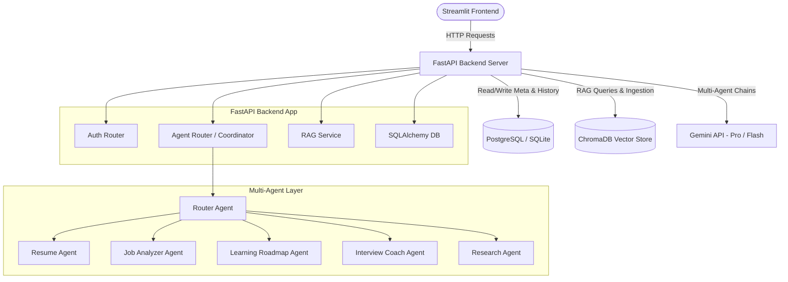

# 🥇 AI-Powered Placement Assistant

The **AI-Powered Placement Assistant** is a production-ready, full-stack, multi-agent AI system designed to help students and job seekers prepare for coding placements, internships, and technical interviews.

By integrating **Generative AI (Gemini 2.5/1.5 Pro)**, **Retrieval-Augmented Generation (RAG)** via **ChromaDB**, and a **Multi-Agent Routing System**, this application conducts resume parsing, job compatibility analysis, skill gap mapping, real-time mock interviews, and company-specific briefing dossiers.

---

## 🚀 Key Features

1. **📄 Resume Analyzer**: Processes PDF/DOCX resumes, calculates ATS readability scores, recommends optimizations, and extracts complete skill trees.
2. **💼 Job Description Matcher**: Accepts job descriptions and matches resume capabilities to calculate overall compatibility and flag missing keywords.
3. **🗺️ AI Learning Roadmap**: Categorizes missing skills into Beginner, Intermediate, and Advanced tiers and constructs personalized study paths with recommended courses, certificates, and capstone projects.
4. **🤖 AI Interview Coach**: Generates interview banks covering Technical, Behavioral, HR, and Project-specific rounds. Evaluates user answers in real-time.
5. **🏢 Company Research Assistant**: Queries local vector DB placement logs and historical interview records to compile briefing dossiers on target companies.
6. **💬 AI Career Chatbot**: Provides career coaching using a Multi-Agent system to classify intent, pull RAG context, and formulate responses.
7. **🎯 Evaluation Framework**: Inspects assistant responses in real-time, scoring Relevance and checking for Hallucinations (grounding check) on a scale of 1.0 to 5.0.
8. **📈 Preparation Dashboard**: Tracks key performance metrics, readiness index progression, extracted skills, and matching history on a glassmorphism dashboard.

---

## 🏗️ System Architecture



---

## 📁 Repository Structure

```
placement-assistant/
├── backend/
│   ├── app/
│   │   ├── config.py             # Settings and Env Config
│   │   ├── database.py           # DB engine and session
│   │   ├── models.py             # SQLAlchemy schemas
│   │   ├── schemas.py            # Pydantic schemas
│   │   ├── security.py           # Auth verification & JWT helpers
│   │   ├── main.py               # Main entrypoint & RAG seeders
│   │   ├── routers/              # API router endpoints
│   │   │   ├── auth.py
│   │   │   ├── resume.py
│   │   │   ├── job.py
│   │   │   ├── matching.py
│   │   │   ├── roadmap.py
│   │   │   ├── interview.py
│   │   │   ├── research.py
│   │   │   ├── chat.py
│   │   │   └── dashboard.py
│   │   └── agents/               # Multi-Agent instances
│   │       ├── base.py
│   │       ├── router.py
│   │       ├── resume_agent.py
│   │       ├── job_agent.py
│   │       ├── learning_agent.py
│   │       ├── interview_agent.py
│   │       └── research_agent.py
│   │   └── services/             # Core Services
│   │       ├── rag.py            # Vector DB and Search
│   │       └── evaluator.py      # Relevance & Hallucination checks
│   ├── requirements.txt
│   └── Dockerfile
├── frontend/
│   ├── app.py                    # Main app login & welcome screen
│   ├── pages/                    # Multi-page sidebar layouts
│   │   ├── 1_Dashboard.py
│   │   ├── 2_Resume_Analyzer.py
│   │   ├── 3_Job_Matcher.py
│   │   ├── 4_Roadmap_Generator.py
│   │   ├── 5_Interview_Coach.py
│   │   ├── 6_Company_Research.py
│   │   └── 7_AI_Career_Chat.py
│   ├── utils/
│   │   ├── api_client.py         # HTTP communications wrapper
│   │   └── ui_helpers.py         # Custom HTML metrics & alerts styling
│   ├── requirements.txt
│   └── Dockerfile
├── data/
│   └── default_materials/
│       └── placement_guide.txt   # Corpus loaded into vector DB on startup
├── docker-compose.yml
├── DEPLOYMENT_GUIDE.md
└── PROJECT_DESCRIPTION.md
```

---

## 🔑 Database Schema

We use SQLAlchemy for object-relational mapping:
- **`users`**: Manages emails, names, and passwords.
- **`resumes`**: Stores parsed skills, education items, achievements, and ATS scores.
- **`job_descriptions`**: Indexes target job qualifications and core stack needs.
- **`resume_matches`**: Holds match percentages, missing requirements, and recommendations.
- **`learning_roadmaps`**: Compiles personalized courses, timelines, and capstones.
- **`interview_preps`**: Stores generated technical and behavioral mock interview sets.
- **`company_research`**: Records researched briefings on products, trends, and processes.
- **`chat_messages`**: Logs histories for RAG-driven conversations.

---

## 🛠️ Local Development & Quick Start

### Prerequisites
- Python 3.10+
- A Google Gemini API Key (get one from Google AI Studio)

### Option 1: Direct Python Setup (Recommended for quick runs)
1. **Clone the repository and go to directory:**
   ```bash
   cd c:\Users\hp\project
   ```

2. **Configure Environment Variables:**
   Create a `.env` file in `c:\Users\hp\project` (or export directly):
   ```env
   GEMINI_API_KEY=your_actual_gemini_api_key_here
   ```

3. **Install Backend Dependencies & Start Server:**
   ```bash
   cd backend
   pip install -r requirements.txt
   uvicorn app.main:app --host 0.0.0.0 --port 8000
   ```
   *(The backend initializes a local database `placement_assistant.db` and indexes `data/default_materials/placement_guide.txt` automatically on startup)*

4. **Install Frontend Dependencies & Start Dashboard:**
   Open a separate shell terminal, then:
   ```bash
   cd frontend
   pip install -r requirements.txt
   streamlit run app.py
   ```
   *(Streamlit launches on `http://localhost:8501`)*

### Option 2: Docker Compose (Fully Containerized)
Launch both services containerized with a single command:
```bash
docker-compose build
docker-compose up
```
*(Ensure `GEMINI_API_KEY` is exported in your environment terminal before running)*

---

## 💬 API Endpoints Summary

- **`/api/auth`**: `/register`, `/token` (JWT login), `/google` (mock social OAuth), `/me` (profile).
- **`/api/resumes`**: `/upload` (PDF/DOCX extraction), `/` (list histories).
- **`/api/jobs`**: `/analyze` (extract required stacks), `/` (list target profiles).
- **`/api/match`**: `/` (evaluate resume to JD alignment), `/{id}` (query recommendations).
- **`/api/roadmaps`**: `/generate` (build skill plans), `/` (retrieve roadmaps).
- **`/api/interview`**: `/generate` (make technical/behavioral tests), `/` (list session history).
- **`/api/research`**: `/{company_name}` (RAG search company intelligence).
- **`/api/chat`**: `/message` (send chat with router agents), `/history/{session_id}` (history lookup).
- **`/api/dashboard`**: `/summary` (KPI statistics and skills count).
